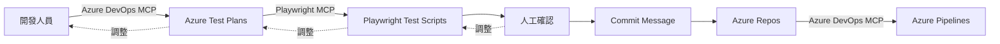

## Playwright 與 Azure DevOps 測試流程圖

以下為由附件圖片轉換而成的 mermaid 流程圖（繁體中文標註），包含主要流程與回饋（調整）路徑。

說明：
- 主流程：開發人員 → Azure Test Plans → Playwright Test Scripts → 人工確認 → Commit Message → Azure Repos → Azure Pipelines。
- 回饋（調整）：人工確認會回饋到 Playwright Test Scripts；Playwright 測試腳本會回饋到 Azure Test Plans；Azure Test Plans 會回饋到開發人員。

如何預覽：
- 在 VSCode 安裝支援 mermaid 的 Markdown 預覽擴充（例如 "Markdown Preview Enhanced" 或 "Markdown Preview Mermaid Support"），然後打開此檔案即可預覽流程圖。
- 或複製 mermaid 區塊到 https://mermaid.live/ 即時檢視與編輯。

-- 已由 docling 轉換（來源：使用者附件圖片）
