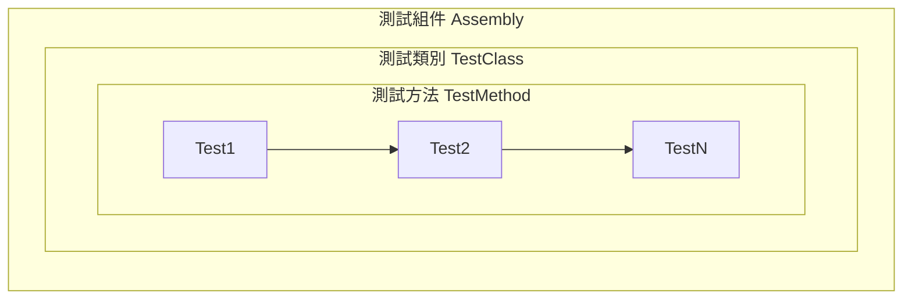

 

在軟體開發過程中，妥善進行測試可以協助我們確保程式碼的功能性與可靠性，不論是最小範圍的**單元測試 (Unit Tests)** 或是模擬實際用戶的**端對端測試(E2E Tests)**，都是品質把關的重要防線，而 MSTest 除了被整合在 Visual Studio 中，簡化了 .NET 應用程式建立和執行單元測試的過程，也可以透過 Azure Pipelines 將既有的測試專案整合到 CI 流程裡，這篇主要帶大家瞭解 MSTest 生命週期以及常用屬性，以便大家更能掌握自己的測試流程。

<!-- more -->

<br>

## 前言
**測試類別(TestClass)** 和 **測試方法(TestMethod)** 是 MSTest 核心要素，一個 TestClass 可以包含一個或多個 TestMethod，而我們實際要執行測試的內容就是寫在每個 TestMethod 裡，一般大家比較熟知的 3A Principle (**A**rrange-**A**ct-**A**ssert) 可以幫助我們快速聚焦測試方法裡面該撰寫的內容，簡單範例如下：

```csharp
[TestClass]
public class MyTestClass
{
    [TestMethod]
    public void TestMethod1()
    {
        // Arrange: 初始化測試過程中所需要的變數、物件或其他設定。
        int a = 1;
        int b = 2;
        
        // Act: 實際測試操作、內容。
        int ans = a + b;

        // Assert: 驗證操作是否產生預期結果。
        int excepted = 3;
        Assert.AreEqual(expected, actual);
    }
}
```

## 測試組件

一個 MSTest 專案建置完成後會產生一個組件(Assembly)，白話來說就是 bin 目錄的 dll 檔案，其中可以包含多個 TestClass，而一個 TestClass 裡可以有各自的 TestMethod (層級如下圖)，此外，我們會使用 **`[TestClass]`** 和 **`[TestMethod]`** 屬性項目在 MSTest 專案標記程式碼中哪些是測試類別與測試方法，下列四種寫法都代表相同的意思：
- [TestClass()]
- [TestClassAttribute()]
- [TestClass]
- [TestClassAttribute]

<div style="max-width: 800px; text-align:center;">

</div>

## 生命週期

當我們實際在撰寫或執行多個測試時，經常需要在不同情境時初始化或清除測試資料，而上述提到的 **組件層級** / **類別層級** / **測試層級** 都提供了 ==Initialize== 和 ==Cleanup== 屬性讓我們可以在適當的時機會處理對應的邏輯。在下列範例程式中：TestProject1 組件中包含了兩個類別：Calculator(加法、減法運算)，CaculatorTests(測試類別)，在測試類別中撰寫了兩個 TestMethod (Test_AddMethod 和 Test_SubtractMethod)，同時也加上了 Constructor / Dispose、AssemblyInit / AssemblyCleanup、ClassInit / Cleanup、TestInit / TestCleanup，大家應該不難發現，這些函式都是成對的，可以直接參考下列範例程式碼與執行結果，瞭解一個測試組件從開始執行到結束歷經了哪些階段。

```csharp
using System.Diagnostics;

namespace TestProject1
{
    public class Calculator
    {
        public int Add(int a, int b)
        {
            return a + b;
        }

        public int Subtract(int a, int b)
        {
            return a - b;
        }
    }

    [TestClass]
    public class CalculatorTests : IDisposable
    {
        private static Calculator calculator;

        public CalculatorTests()
        {
            Debug.WriteLine("CalculatorTests - Constructor");
        }

        // 在整個測試程序集開始時執行一次
        [AssemblyInitialize]
        public static void AssemblyInit(TestContext context)
        {
            Debug.WriteLine("AssemblyInitialize: 測試程序集初始化。");
        }

        // 在所有測試執行前初始化，只執行一次
        [ClassInitialize]
        public static void ClassInit(TestContext context)
        {
            Debug.WriteLine("ClassInitialize: 初始化 Calculator 類別實例。");
            calculator = new Calculator();
        }

        // 在每個測試方法執行前調用
        [TestInitialize]
        public void TestInit()
        {
            Debug.WriteLine("TestInitialize: 開始執行新的測試。");
        }

        // 測試加法功能
        [TestMethod]
        [TestCategory("CalculatorTests")]
        public void Test_AddMethod()
        {
            Debug.WriteLine("Test_AddMethod: 測試加法運算。");
            int result = calculator.Add(5, 3);
            Assert.AreEqual(8, result, "加法結果不正確");
        }

        // 測試減法功能
        [TestMethod]
        [TestCategory("CalculatorTests")]
        public void Test_SubtractMethod()
        {
            Debug.WriteLine("Test_SubtractMethod: 測試減法運算。");
            int result = calculator.Subtract(10, 5);
            Assert.AreEqual(5, result, "減法結果不正確");
        }

        // 在每個測試方法執行後調用
        [TestCleanup]
        public void TestCleanup()
        {
            Debug.WriteLine("TestCleanup: 測試完成，清理測試上下文。");
        }

        // 在所有測試執行完畢後清理，只執行一次
        [ClassCleanup]
        public static void ClassCleanup()
        {
            Debug.WriteLine("ClassCleanup: 清理 Calculator 類別實例。");
            //calculator = null;
        }

        // 在整個測試程序集結束時執行一次
        [AssemblyCleanup]
        public static void AssemblyCleanup()
        {
            Debug.WriteLine("AssemblyCleanup: 測試程序集清理。");
        }

        public void Dispose()
        {
            Debug.WriteLine("CalculatorTests - Dispose");
        }
    }
}
```



## 常用屬性

### 逾時設定 TimeoutAttribute
**`TimeoutAttribute`** 用於設定測試方法的最大執行時間（以**毫秒**為單位）。如果執行測試超過指定的時間限制，測試則會失敗，這個屬性可以讓我們避免測試執行時間過長，或是為某些測試情境設定一個逾時期限，如下範例：

```csharp
using Microsoft.VisualStudio.TestTools.UnitTesting;
using System.Threading;

namespace TestProject1
{
    [TestClass]
    public class TimeoutExampleTests
    {
        // 這個測試會在 500 毫秒內完成，所以它會通過
        [TestMethod]
        [Timeout(1000)]  // 設置 1 秒的超時
        public void TestMethod_WithSufficientTime()
        {
            Thread.Sleep(500);  // 模擬較短的處理時間
            Assert.AreEqual(4, 2 + 2);  // 假設這是測試邏輯
        }

        // 這個測試會因為超時而失敗
        [TestMethod]
        [Timeout(1000)]  // 設置 1 秒的超時
        public void TestMethod_WithTimeout()
        {
            Thread.Sleep(1500);  // 模擬超過1秒的處理時間
            Assert.AreEqual(4, 2 + 2);  // 假設這是測試邏輯
        }
    }
}

```

### 平行測試 ParallelizeAttribute 
自 MSTest v2 起，提供了兩個關於平行測試的屬性：
- **`ParallelizeAttribute`**：可以應用於類別或測試集來啟用平行測試。
- **`DoNotParallelizeAttribute`**：可以應用於個別測試方法來==禁止==它與其他測試並行執行。

```csharp
using Microsoft.VisualStudio.TestTools.UnitTesting;
using System.Threading;

namespace TestProject1
{
    [TestClass]
    [Parallelize(Workers = 2, Scope = ExecutionScope.MethodLevel)]  // 啟用並行，指定最多兩個工作線程
    public class ParallelTests
    {
        [TestMethod]
        public void TestMethod1()
        {
            Thread.Sleep(1000);  // 模擬工作
            Assert.AreEqual(4, 2 + 2);
        }

        [TestMethod]
        public void TestMethod2()
        {
            Thread.Sleep(1000);  // 模擬工作
            Assert.AreEqual(9, 3 * 3);
        }

        // 禁止這個方法與其他測試並行執行
        [TestMethod]
        [DoNotParallelize]
        public void TestMethod3_DoNotParallelize()
        {
            Thread.Sleep(1000);  // 模擬工作
            Assert.AreEqual(15, 5 * 3);
        }
    }
}
```

- **`[Parallelize(Workers = 2, Scope = ExecutionScope.MethodLevel)]`**：
  - Workers = 2 表示最多使用 2 個執行緒來執行平行測試。
  - Scope = ExecutionScope.MethodLevel 表示在方法層級平行測試，代表每個測試方法可以平行執行；如果想要在類別層級，可以設定為 ExecutionScope.ClassLevel。
- TestMethod1 和 TestMethod2：
  因為類別層級已經使用 Parallelize 屬性，並且設定 Workers = 2 表示這兩個測試方法會在執行緒池裡平行執行。  
- TestMethod3_DoNotParallelize：
  這個方法加了 **`[DoNotParallelize]`**，所以它==不會==與其他方法同時執行，當 TestMethod3_DoNotParallelize 執行時，其他平行測試會暫停，直到這個測試完成。

## 後記
MSTest 從推出至今已經來到了 v3，從一開始只能在 Windows 平台上運作，隨著 .NET Framework 的演進，也逐步支援跨平台運行，特別是在 .NET Core 和 .NET 5 之後，MSTest 成為了 .NET 生態系中一個可靠且簡單易用的測試框架。它不僅適合快速撰寫單元測試，還能與多種持續整合和部署工具無縫結合，例如：Azure DevOps 和 GitHub Actions。

由於應用程式複雜度日益提高，MSTest 從 v2 開始也提供了平行測試，允許多個測試同時執行，這不僅加快了測試速度，也提高了 CI/CD 的效能。平行測試使開發人員能夠在不影響測試完整性的前提下，顯著縮短測試週期，對大型專案尤為重要。此外，MSTest 也包含：數據驅動測試、生命週期管理、異常處理測試等，這讓我們能夠更全面地驗證應用程式的功能和效能。

MSTest 的易用性使得它適合不同規模的專案，加上 Visual Studio 開發工具與 Azure DevOps Services 的支援，不論是小型開發團隊或是大型企業應用，都能輕鬆採用，為軟體開發專案品質把關，也讓整個 DevOps 流程更加完善。

<div class="tips">
<font color="black">
<a href="https://github.com/microsoft/testfx" target="_blank">⁍ Microsoft Test Framework</a><br>
<a href="https://learn.microsoft.com/zh-tw/dotnet/core/testing/unit-testing-with-mstest?source=recommendations" target="_blank">⁍ 使用 MSTest 和 .NET 進行 C# 單元測試</a><br>
<a href="https://learn.microsoft.com/zh-tw/dotnet/core/testing/unit-testing-mstest-writing-tests-attributes" target="_blank">⁍ MSTest 屬性</a><br>
<a href="https://www.meziantou.net/mstest-v2-setup-a-test-project-and-run-tests.htm" target="_blank">⁍ MSTest v2: Setup a test project and run tests</a>
</font>
</div>