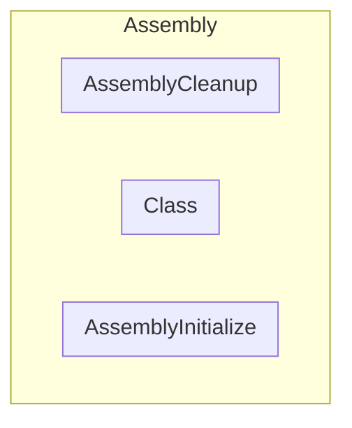
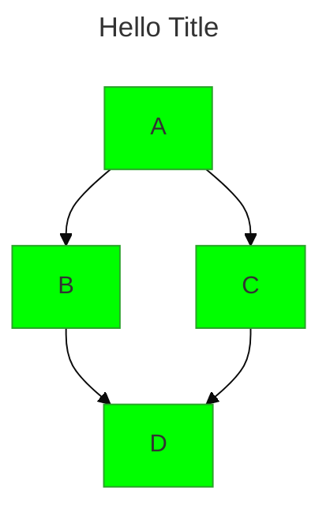
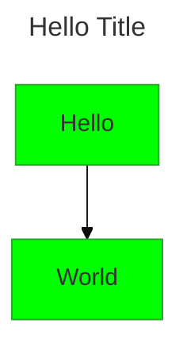
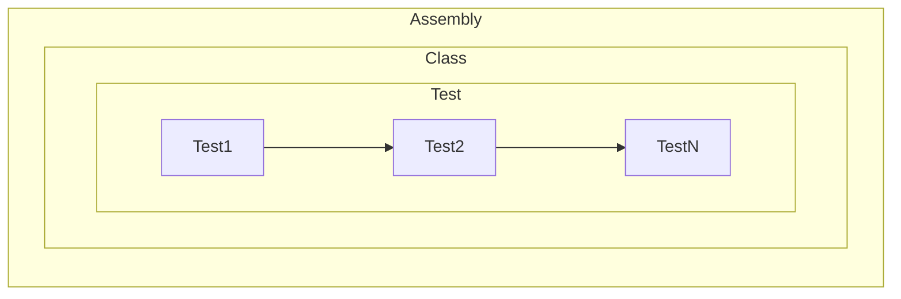

The background color is `#ffffff` for light mode and `#000000` for dark mode.

>  測試
>

**圖片太小可以在圖上按右鍵，由新分頁檢視圖片。**

> [!IMPORTANT]
> 這是一個重要的訊息。

> [!NOTE]
> 這是一個普通的提示。

> [!TIP]
> 這是一個小技巧。

> [!WARNING]
> 這是一個警告訊息。

::: info
This is an info box.
:::

::: tips
This is a tip.
:::

::: warning
This is a warning.
:::

::: danger
This is a dangerous warning.
:::

::: success
This is an info box.
:::


this is primary note ...



Lorem ipsum dolor sit amet, consectetur adipiscing elit. Pellentesque hendrerit lacus ut purus iaculis feugiat. Sed nec tempor elit, quis aliquam neque. Curabitur sed diam eget dolor fermentum semper at eu lorem.



NEW: DevDocs now comes with syntax highlighting. http://devdocs.io


==**測試**==
==測試==
 

- []
- [x]

H~2~O
X^2^

:)

*[HTML]: Hyper Text Markup Language
*[W3C]:  World Wide Web Consortium
The HTML specification
is maintained by the W3C.

++下底線++

[ ] Mercury
[x] Venus

### Solar System Exploration, 1950s – 1960s

- [ ] Mercury
- [x] Venus
- [x] Earth (Orbit/Moon)
- [x] Mars
- [ ] Jupiter
- [ ] Saturn
- [ ] Uranus
- [ ] Neptune
- [ ] Comet Haley

+++ 折疊內容
abcd1234
+++

tips

success

warning

danger

**This is bold text**	
_This text is italicized_	
~~This was mistaken text~~	
**This text is _extremely_ important**	
***All this text is important***	
This is a subscript text	
This is a superscript text	

Text that is not a quote

> Text that is a quote

Use `git status` to list all new or modified files that haven't yet been committed.

This site was built using [GitHub Pages](https://pages.github.com/).

64

Here is a simple footnote[^1].

A footnote can also have multiple lines[^2].

[^1]: My reference.
[^2]: To add line breaks within a footnote, prefix new lines with 2 spaces.
  This is a second line.

